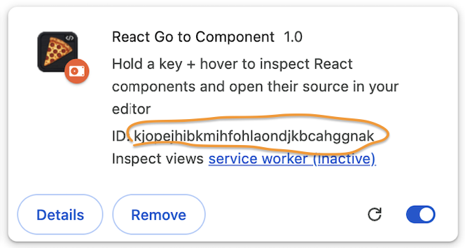

# React Go to Component

Chrome extension to jump from any element on a React page to its source code in your editor.

Hold **Option** + hover any element to see the component, file, and code preview. Click to open in your editor at the exact line. Right-click any element and select **Go to source** for a quick jump.

## Setup

**1. Load the extension** — `chrome://extensions` → Developer mode → Load unpacked → select this folder. Note the Extension ID.



**2. Install native messaging host (macOS):**
```sh
cd react-go-to-component
./install-host.sh <your-extension-id>
```
Restart Chrome after this.

**3. Configure** — click the extension icon in toolbar:
- **Project root**: full path to your frontend (e.g. `/Users/you/Projects/repo/frontend_service`)
- **Editor**: path to editor binary (default: `/usr/local/bin/code`)
- **Activation key**: default Option, click to change

Requires: React dev mode on localhost, macOS, editor with CLI (`code --goto`).

## Usage

1. Hold activation key (default **Option**) — cursor becomes crosshair
2. Hover any element — overlay shows component name, file, code preview
3. Click any code line to open at that line, or click **→** to open the main match
4. Release key — overlay stays briefly so you can interact with it
5. Right-click any element → **Go to source** — opens editor directly

Alternates section shows the component usage chain: where the component is used, its parent page, etc.

## How it works

- Installs a React DevTools hook to capture fiber roots at render time
- On picker activation, batch-annotates DOM elements with `data-source` and `data-component` attributes from `_debugSource`
- Hover reads pre-computed attributes (no fiber walking per mousemove)
- Source map resolution via Vite dev server corrects line numbers shifted by react-refresh preamble
- Fiber chain enriches alternates with component-usage hierarchy
- Native messaging host opens the editor and reads source files for preview

## Architecture

```
inject.js       MAIN world: hook, annotation, overlay, hint collection
content.js      ISOLATED world: validates and bridges inject.js <-> background.js
background.js   Service worker: source map resolution, native host messaging, context menu
native-host/    Python: opens editor, reads source files, hint-based line matching
```
